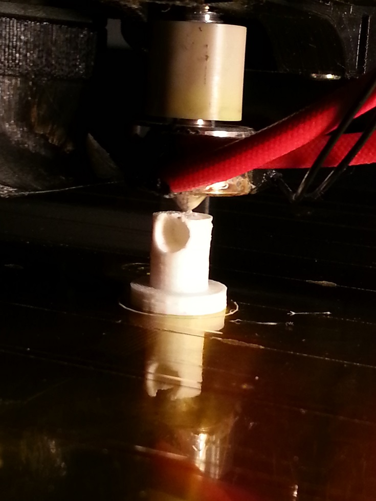
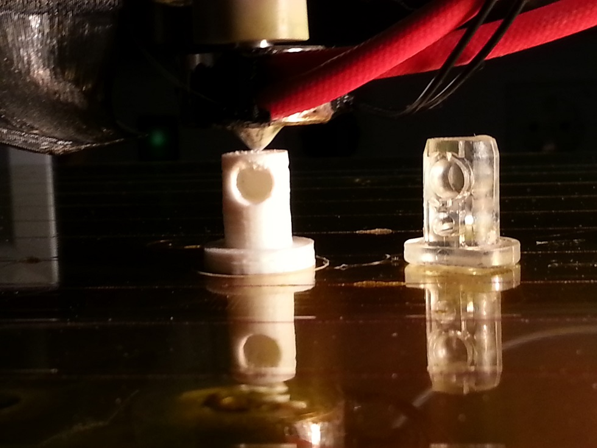
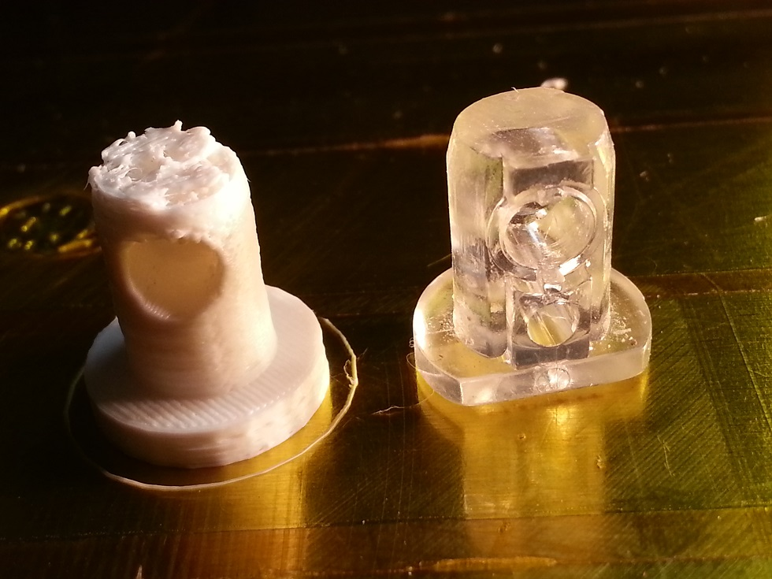

##Schrankbrettnubbsi

In Fachkreisen auch Bibbus genannt.

Plastikstöpsel um den Metalstift für das neue Regal im Bytespeicher.
Siehe Originalbild.

Maße nur ungenau mit Zollstock abgenommen.
Laut Sketchup ist es kein 'Solid', der STL-Export klappt aber.

### Versuch 1

Modell war nicht ganz fertig, Schnittebene fehlte.

Versuch, Loch ohne Stützstruktur zu drucken. Klappt zwar, verursacht aber Störungen in den Ebenen am und über dem Abschluss.

  
  
  

